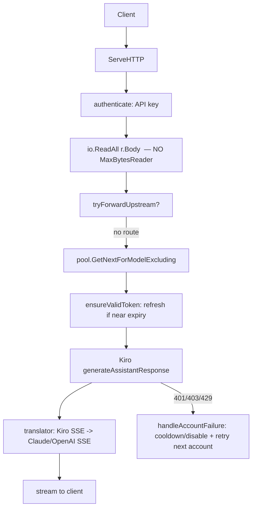
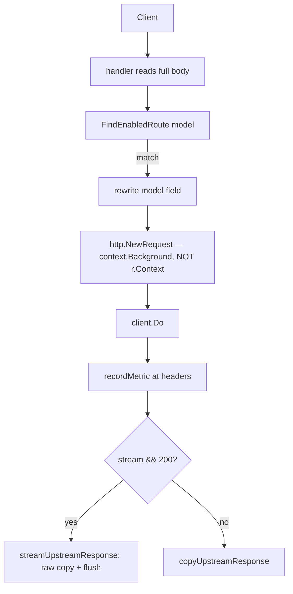
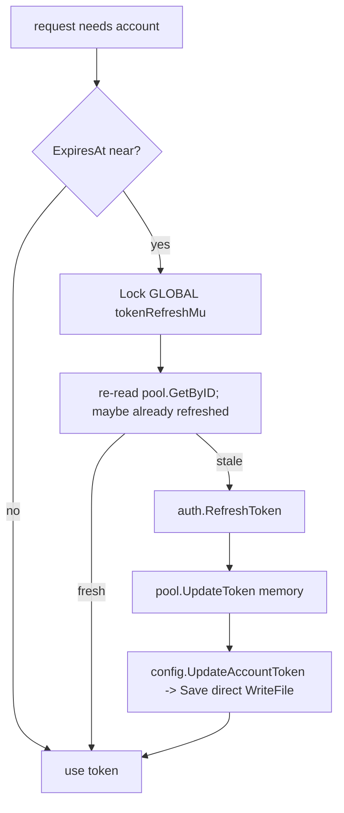
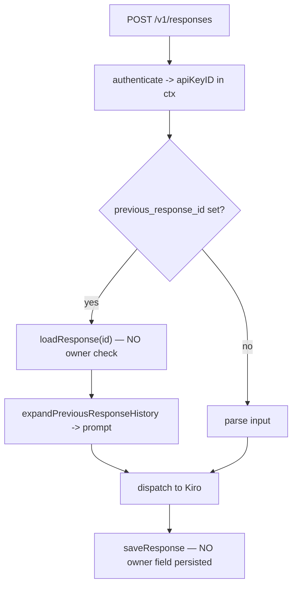
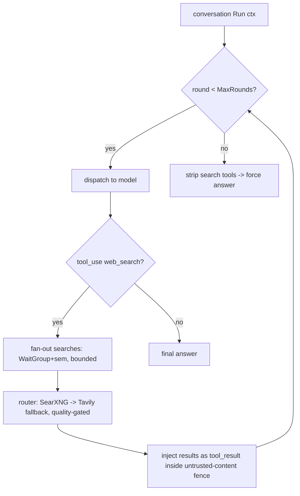

# Kiro-Go — Architecture & Security Audit

## 2. Revision audited

- **Repository:** `topmetax-ctrl/Kiro-Go` (origin), fork of `Quorinex/Kiro-Go` (upstream)
- **Branch:** `feat/upstream-forwarding`
- **Commit SHA:** `9bdc617943cf924ba4529b0e9e19573183e2a837`
- **Working tree:** clean except one untracked doc (`docs/fork-comparison-2026-07-12.md`, not code). HEAD == `origin/feat/upstream-forwarding` (0 ahead / 0 behind after fetch).
- **Toolchain observed:** Go 1.26.5 (go.mod declares `go 1.21`). Sole external dep: `github.com/google/uuid v1.6.0`.
- **Audit date:** 2026-07-12
- **Baseline commands run:** `go vet ./...` (clean), `go test ./...` (2 pre-existing FAILs, see below), `go test -race ./...` (no race in existing suite), `golangci-lint` (not installed — not added).

> All findings below apply to commit `9bdc617` unless stated otherwise. Line numbers are given only where read directly; where a symbol may have moved, the function name + verbatim snippet is the anchor.

**Pre-existing test failures on this SHA (not introduced by audit):**
- `TestClaudeToolResultMixedTextAndImage` — `translator_test.go:558` ("expected one tool result")
- `TestOpenAIToolResultImageCarriedWhenFollowedByUser` — `translator_test.go:635` ("expected tool image carried … got 0")

These fail under both plain and `-race` runs. They are correctness regressions in the translator tool-result path and must be triaged before any refactor (Phase 0 depends on a green baseline).

---

## 1. Executive summary

**What it does.** A single-process Go reverse proxy that presents Anthropic (`/v1/messages`) and OpenAI (`/v1/chat/completions`, `/v1/responses`) compatible APIs, backed by a pool of Kiro/CodeWhisperer accounts with weighted round-robin, automatic OAuth refresh (AWS Builder ID, IAM IdC, Kiro Hosted SSO via Microsoft Entra, API-key), SSE streaming, an admin panel, a native web-search server-tool (SearXNG + Tavily), and a per-model **upstream-forwarding** subsystem that proxies selected models to external OpenAI/Anthropic-compatible endpoints with a live metrics dashboard.

**Strengths (verified, not assumed).**
- The **web-search subsystem** is the best-engineered part: bounded rounds/searches, `r.Context()` propagation, layered timeouts, `io.LimitReader` response caps, prompt-injection warning fence, bounded-concurrency fan-out with `WaitGroup`+semaphore+mutex. No SSRF surface (operator-fixed base URLs, `url.Values`-encoded params). No data race found.
- The **forwarding metrics package** (`metrics/metrics.go`) is uniformly mutex-guarded on every read and write path — no stats race.
- **Responses storage** uses atomic write (tmp+rename, `0o600`), crypto-random IDs, and `sanitizeResponseID` strips path separators — no path traversal, IDs not brute-forceable.
- The **Entra endpoint allow-list matcher** uses a correct leading-dot suffix boundary — not a naive `Contains`.
- Foreground token refresh **does** dedup concurrent refreshes of the same account (double-check under lock).

**Biggest risks.**
- **CRIT-001** — Persisted external-IdP endpoints (`idpTokenEndpoint`/`issuerUrl` in `data/config.json`) are **not re-validated** before the refresh token is POSTed to them. A tampered config exfiltrates the refresh token to an arbitrary host.
- **CRIT-002** — Account pool getters return `*config.Account` pointing into the live slice **after the lock is released**; concurrent writers mutate the same struct → data race on token/stats fields.
- **CRIT-003** — Responses API has **no owner model at all**: `loadResponse(id)` takes no key identity and no owner field is persisted, so any API key can replay any other key's stored conversation via `previous_response_id` (authorization gap; not brute-force since IDs are random).
- **HIGH** — non-atomic `config.Save()` (`os.WriteFile`) can truncate `config.json` on crash; background refresh bypasses the foreground refresh mutex; unbounded `io.ReadAll(r.Body)` at ingress; default bind `0.0.0.0` + plaintext API keys + `ACAO: *` + no auth rate-limit + non-constant-time API-key compare; no graceful shutdown.

**Production multi-user fit.** Not yet. CRIT-002 and CRIT-003 must be fixed before exposing to more than one trusted user. CRIT-001 must be fixed before any deployment where `data/config.json` is not fully trusted.

**Horizontal-scaling fit.** Single-instance only today. All state (accounts, API keys, stored responses, prompt-cache tracker, forward metrics) is in-process or on the local filesystem with a non-atomic writer and no cross-replica coordination. Running two replicas would double background refreshes, split metrics/quota, and risk config write races. See §7 and §12.

---

## 3. Architecture map

### Module map

| Package | Role | Notable state |
|---|---|---|
| `main` | Entrypoint, `http.Server` lifecycle, TLS | none |
| `auth` | OAuth/OIDC per method; token refresh; Entra allow-list; loopback SSO | per-flow SSO session state |
| `config` | Config + account store (JSON), API keys, upstreams/routes, websearch cfg | `cfg *Config` under `cfgLock sync.RWMutex`; `cfgPath` |
| `pool` | Account pool, weighted RR, cooldown, model lists | `AccountPool` under `mu sync.RWMutex` |
| `proxy` | Router, handlers, translator, Kiro client, responses API, web search, forwarding, prompt-cache | `Handler` + `tokenRefreshMu`, `modelsCacheMu`; global `promptCacheTracker` |
| `metrics` | Forward-outcome counters, ring, time-series, SSE | `store` under `mu sync.Mutex` |
| `logger` | Level logging + SSE log console | broadcast hub |

**God file:** `proxy/handler.go` is 5065 LOC and owns routing, auth, all admin endpoints, background workers, and dispatch. This is the single largest maintainability liability.

### Router (`proxy/handler.go` `ServeHTTP`)

Manual `switch` on `r.URL.Path`. CORS `Access-Control-Allow-Origin: *` set on **every** response before routing. Public API paths require API-key auth via `authenticateForClaude`/`authenticateForOpenAI`; `/admin/*` gated by IP allow-list then `X-Admin-Password`; `/v1/models` and `/health` unauthenticated; `/v1/stats` API-key gated.

### Flow 1 — Direct request to Kiro

Shared state: reads pool slice (RLock, but returns live pointer — see CRIT-002); writes cooldown/stats under pool write lock. External I/O: Kiro. Retry: up to `maxAccountRetryAttempts`, excluding failed accounts. Cancellation: Kiro call path uses request context (verify per-call). Metrics: pool stats + per-key usage.

### Flow 2 — Upstream forwarding (`proxy/upstream_forward.go` `tryForwardUpstream`)

Shared state: forward metrics (mutex-safe). **Bypasses account pool and per-key quota** (documented in the function comment). No `r.Context()` → client disconnect does not cancel upstream. Latency measured at headers, not stream end. Client headers dropped except 5 hard-coded ones. Body fully buffered in RAM.

### Flow 3 — Token expiry + refresh (`ensureValidToken`)

Coordination: **one global mutex** for all accounts (serializes cross-account refresh). Background path (Flow 7) does **not** take this mutex. Persist non-atomic. No re-read of persisted refresh token across paths.

### Flow 4 — `/v1/responses` with `previous_response_id` (`responses_handler.go`)

CRIT-003 lives here: `apiKeyID` is computed (`apiKeyIDFromContext`) but used only for usage accounting; the load path never checks it and the store never records it.

### Flow 5 — Web-search conversation loop (`kiro_conversation_runner.go`)

Verified safe: `MaxRounds`/`MaxSearches` from config; request `max_uses` can only lower; `context.WithCancel(ctx)`; per-provider timeouts; `io.LimitReader` (SearXNG 2 MiB, Tavily 1 MiB); result content capped (2500/result, 16000 total). Soft gap: results not sanitized, fence sentinel not escaped (LOW-002).

### Flow 6 — Account import + profile resolution

`apiImportCredentials` (`json.NewDecoder(r.Body)`, no size cap) → normalize auth method → optional refresh-at-import → `ResolveProfileArn` probes regions `[us-east-1, eu-central-1]` (`profileProbeRegions`) → first region returning a profile wins (`return profileArn` on first hit) → persist ARN + region.

### Flow 7 — Background refresh (`backgroundRefresh` → `refreshAllAccounts`)

30-min ticker (10 s warm-up). Iterates `config.GetAccounts()` **copies**; for near-expiry accounts calls `auth.RefreshToken` **without** `tokenRefreshMu`; persists via `config.UpdateAccountToken` (**error discarded**) + `pool.UpdateToken`; then `pool.Reload()`. Model cache refreshed on the same ticker.

### Flow 8 — Model discovery / cache

`refreshModelsCache` under `modelsCacheMu`; per-account model lists cached in `pool.SetModelList` and consulted by `GetNextForModel*`. Cold start (no list) = optimistic allow.

---

## 4. Verified findings

### CRIT-001 — Persisted external-IdP token endpoint is not re-validated before refresh (SSRF / refresh-token exfiltration)
- **Severity:** Critical · **Confidence:** High
- **File/function:** `auth/kiro_sso.go` `RefreshExternalIdpToken` (called from `auth/oidc.go` `RefreshToken` for `external_idp` accounts, using `account.IssuerURL` / `account.IdPTokenEndpoint` loaded from `data/config.json`).
- **Evidence:** The allow-list validator `validateExternalIdpURL` (correct leading-dot suffix match against `.microsoftonline.com/.us/.cn`, rejects non-HTTPS and IP literals) is **not** called on the refresh path. `RefreshExternalIdpToken` builds `http.NewRequest("POST", tokenEndpoint, …)` and does `client.Do(req)` with no re-validation of `tokenEndpoint`/`issuerURL`. `resolveExternalIdpTokenEndpoint`→`discoverOIDCEndpoints` also performs no allow-list check.
- **Impact:** If `data/config.json` is tampered (or an import path persisted an unvalidated endpoint), the account's refresh token is sent to an attacker-controlled host on the next background/foreground refresh. Persisted config is treated as trusted.
- **Preconditions:** Attacker can write the config file, or a prior import stored an unvalidated endpoint. Note the loopback SSO exchange client sets `CheckRedirect: ErrUseLastResponse` (safe), but the refresh path may use `GetAuthClientForProxy` which has no `CheckRedirect` — **needs-more-check** whether that client follows redirects to a disallowed host.
- **Recommended architecture:** Central `EndpointPolicy` validated at three boundaries — import, discovery, and immediately before every outbound token request — plus on config load. Never trust persisted endpoints.
- **Minimal safe fix:** Call `validateExternalIdpURL(tokenEndpoint)` (and `issuerURL`) at the top of `RefreshExternalIdpToken` and in `resolveExternalIdpTokenEndpoint`; fail closed.
- **Long-term fix:** `EndpointPolicy` type with table-driven tests; set `CheckRedirect` to reject cross-host redirects on all auth clients.
- **Tests required:** table-driven allow-list (apex, sub, look-alike `…microsoftonline.com.evil.com`, IP literal, http scheme, punycode); refresh with tampered endpoint → rejected; redirect-to-disallowed → rejected.
- **Migration risk:** Low — validation only rejects already-invalid endpoints; legitimate Microsoft endpoints pass.

### CRIT-002 — Account pool returns pointers into the live slice after unlock (data race + stale state)
- **Severity:** Critical · **Confidence:** High
- **File/function:** `pool/account.go` `GetNextExcluding` / `GetNextForModelExcluding` / `GetByID` return `&p.accounts[idx]`; the `RLock` is released by `defer` when the function returns, so the caller holds a pointer into the shared, mutable backing array.
- **Evidence:** Getters take `p.mu.RLock()` + `defer RUnlock()` and `return &p.accounts[idx]`. Writers mutate the **same** struct fields under `p.mu.Lock()`: `UpdateToken` (`p.accounts[i].AccessToken = …`), `UpdateStats` (`p.accounts[i].RequestCount++ …`), and `Reload` **replaces the whole slice** (`p.accounts = weighted`). A request goroutine reading `account.AccessToken`/`ExpiresAt` while `UpdateToken`/`UpdateStats` writes them is an unsynchronized read/write on the same memory → data race under the Go memory model. `Reload` reallocation additionally makes the returned pointer stale (points into the old array).
- **Why `-race` was green:** the existing test suite does not exercise a getter-held pointer concurrently with `UpdateStats`/`UpdateToken`/`Reload`. Absence of a race report here is **not** proof of safety — it means no test drives the pattern. A reproduction test is required (Phase 0).
- **Impact:** Torn reads of token/expiry (could use a half-updated token), lost/incoherent stats, use of an account pointer that no longer reflects pool membership after `Reload`. `Account` is all value types (no nested maps/slices/pointers), so a **copy** is self-contained — the fix does not need deep-copy.
- **Recommended architecture:** Return an **immutable snapshot by value** (`config.Account`) from all selection getters, or introduce a per-account state object behind its own `RWMutex` owned by a central `AccountManager`. Given the project size, value-snapshot from the pool + a small `AccountManager` for mutations is the right weight; actor/event-loop is overkill.
- **Minimal safe fix:** Change getters to return `config.Account` (value copy under the read lock). Update callers to treat the account as a snapshot and route mutations back through `pool.UpdateToken`/`UpdateStats`/`RecordError` (which already lock).
- **Long-term fix:** `AccountManager` owns all account mutable state; requests receive read-only snapshots; refresh writes go through a `TokenManager` (see CRIT/HIGH refresh items).
- **Tests required:** concurrency test — N goroutines calling `GetNextForModel` and reading token fields while a writer loops `UpdateStats`/`UpdateToken` and `Reload`, run with `-race`; must be clean after the fix and (to prove the finding) RED before it.
- **Migration risk:** Medium — every caller of the getters must stop mutating the returned account in place. `ensureValidToken` currently writes back into the returned `*account` (e.g. `account.AccessToken = …`); those writes must be re-pointed at pool methods.

### CRIT-003 — Responses API has no ownership model (cross-key conversation replay)
- **Severity:** Critical · **Confidence:** High
- **File/function:** `proxy/responses_handler.go` `handleResponses` calls `loadResponse(req.PreviousResponseID)` with no identity; `proxy/responses_store.go` `loadResponse(id)` / `saveResponse` and `storedResponseDoc` persist **no** owner/apiKeyID field.
- **Evidence:** `apiKeyID := apiKeyIDFromContext(r.Context())` is computed but passed only to `recordSuccessForApiKey` (usage). `loadResponse` reads the file purely by ID; `expandPreviousResponseHistory(prev)` then injects the prior conversation into the new prompt. `storedResponseDoc` fields: id/object/created_at/status/model/output/usage/previous_response_id/metadata/instructions/stored_input/stored_at — no owner.
- **Impact:** With multiple API keys (multi-user), key B that learns/guesses a response ID created by key A can retrieve A's stored conversation content. This is an **authorization** gap, not a guessing bug: IDs are `crypto/rand` 12 bytes + time, so **not** brute-forceable, but there is no auth check even for a leaked/logged ID.
- **Preconditions:** `RequireApiKey` on with ≥2 keys; attacker obtains a victim response ID (client logs, telemetry, shared history). When auth is disabled, all responses share one anonymous scope (acceptable single-user, unsafe multi-user).
- **Recommended architecture:** Persist a **stable key ID** (not the raw key) as `owner` on every stored response; `loadResponse(id, owner)` returns generic not-found on mismatch (no enumeration signal); introduce a `ResponseStore` interface (filesystem today, DB/object-store later).
- **Minimal safe fix:** Add `Owner string` to `storedResponseDoc`; set it from `apiKeyID` on save; add owner param to `loadResponse` and compare; treat legacy empty-owner as either "migrate/purge" or "owned by first accessor" (decide in Decision log).
- **Long-term fix:** `ResponseStore` interface + tenant scope; retention/expiry already present (30-day TTL + purge) — extend to per-owner.
- **Tests required:** cross-key isolation (same key allowed; different key denied with generic error; legacy empty-owner behavior; auth-disabled behavior).
- **Migration risk:** Medium — existing stored responses have no owner; must choose migrate vs purge. TTL bounds exposure to 30 days.

### HIGH-001 — `config.Save()` is a non-atomic write (config corruption on crash)
- **Severity:** High · **Confidence:** High
- **File/function:** `config/config.go` `Save` = `json.MarshalIndent(cfg,…)` then `os.WriteFile(cfgPath, data, 0600)` — no tmp+rename. Contrast `responses_store.go saveResponse` which does tmp+rename correctly.
- **Impact:** A crash or disk-full mid-write truncates `data/config.json`, losing **all** accounts/keys/routes. Every token refresh calls this (`UpdateAccountToken`→`Save`), so the write rate is high.
- **Minimal safe fix:** write to `cfgPath+".tmp"` (0600) then `os.Rename`. **Long-term:** a `ConfigStore` with atomic write + optional backup rotation.
- **Tests required:** fault-injection (rename fails → old file intact; partial write leaves no truncated primary).
- **Migration risk:** Low.

### HIGH-002 — Background refresh bypasses the foreground refresh mutex; refresh errors discarded; no cross-path coordination
- **Severity:** High · **Confidence:** High
- **File/function:** `proxy/handler.go` `refreshAllAccounts` calls `auth.RefreshToken(account)` with **no** `tokenRefreshMu`; `config.UpdateAccountToken(...)` return value is **discarded**. Same for the admin batch-refresh and admin single-account paths (`auth.RefreshToken` with no lock). Foreground `ensureValidToken` holds `tokenRefreshMu` (a single **global** mutex).
- **Evidence:** grep of `auth.RefreshToken(` call sites: `ensureValidToken` (locked), `refreshAllAccounts` (unlocked), admin batch (~unlocked), import temp account (unlocked), admin single (unlocked), `ResolveProfileArn` fallback (unlocked).
- **Impact:** (a) background + foreground can refresh the same account concurrently; with Entra rotation this produces an **orphaned but still-valid** new token (see disproved claim §5 — **not** lockout). (b) The global mutex serializes refreshes across **different** accounts — a scaling bottleneck. (c) Discarded `UpdateAccountToken` error → silent memory/disk divergence: pool has the new token, disk keeps the old.
- **Recommended architecture:** A `TokenManager` with **per-account** `singleflight.Group` (dedup by account ID, no cross-account blocking) that **all** refresh paths call; atomic persist inside it; error propagated and surfaced.
- **Minimal safe fix:** route every refresh through one method that takes a per-account lock (map of `*sync.Mutex` keyed by ID, or `golang.org/x/sync/singleflight`) and checks the persist error. Note: a raw mutex map needs its own lifecycle/cleanup — prefer `singleflight` which self-cleans.
- **Tests required:** 100 concurrent `ensureValidToken` on one account → exactly one `RefreshToken` call; N accounts refresh concurrently → no serialization; persist-fails → error surfaced, memory not silently ahead of disk. All under `-race`.
- **Migration risk:** Medium — touches all refresh call sites.

### HIGH-003 — Inbound request body is read unbounded into memory
- **Severity:** High · **Confidence:** High
- **File/function:** `proxy/handler.go` — `io.ReadAll(r.Body)` at the Claude, OpenAI, and (separately) responses/import handlers, with **no** `http.MaxBytesReader`. `config.GetMaxPayloadBytes` (default 2 MB) caps the **serialized Kiro payload downstream**, not the inbound read. `apiImportCredentials` and `apiUpdateUpstreams` use `json.NewDecoder(r.Body)` with no cap.
- **Impact:** A single large POST (or many concurrent) exhausts memory before any cap applies. `maxPayloadBytes` is not applied at ingress on any public/admin endpoint.
- **Recommended architecture:** one ingress middleware wrapping `r.Body` in `http.MaxBytesReader` sized per endpoint class (chat vs admin-import), returning HTTP 413.
- **Minimal safe fix:** wrap `r.Body` before `io.ReadAll`/`Decode` at each entry.
- **Tests required:** oversized body → 413; boundary at limit passes.
- **Migration risk:** Low.

### HIGH-004 — No graceful shutdown; background goroutines leak on stop
- **Severity:** High · **Confidence:** High
- **File/function:** `main.go` calls `srv.ListenAndServe()` with no `signal.Notify`/`srv.Shutdown(ctx)`. `Handler.stopRefresh` channel exists but is never closed (no `Close()`/shutdown path).
- **Impact:** On SIGTERM (container stop, redeploy) in-flight SSE streams are cut mid-response; no drain. Background tickers (`backgroundRefresh` 30m, `backgroundStatsSaver` 30s, forward-stats tickers 25s ×2) are killed abruptly; an unsaved stats window is lost. Not a leak in a long-lived process, but no clean stop.
- **Minimal safe fix:** `signal.Notify(SIGINT/SIGTERM)`, `srv.Shutdown(ctx)` with a drain deadline, close `stopRefresh`, flush stats.
- **Tests required:** integration — SIGTERM during a stream drains within deadline; stats flushed once on shutdown.
- **Migration risk:** Low.

### HIGH-005 — Weak default security posture (defense-in-depth)
- **Severity:** High (aggregate) · **Confidence:** High
- **Evidence:**
  - Default bind `Host: "0.0.0.0"` (`config/config.go` init default) — public by default; loopback only if Host explicitly blanked. The code already emits a `publicBind && (defaultPassword||authDisabled)` warning.
  - API keys stored **plaintext** (`ApiKeyEntry.Key` `json:"key"`), masked only for display.
  - API-key compare is plain `==` linear scan (`config/apikeys.go FindApiKeyByValue`) — **not** constant-time (admin password **is** constant-time via `subtle.ConstantTimeCompare`).
  - `Access-Control-Allow-Origin: *` on all routes incl. `/admin/api/*` (no credentials header, so cookies not exposed cross-origin, but any origin can drive the admin API if it holds the password header).
  - No brute-force / rate-limit on admin login or API-key auth.
- **Impact:** A default `docker run` is internet-exposed; a leaked config file leaks all keys verbatim; API-key timing side-channel; no lockout on credential guessing.
- **Minimal safe fixes:** default bind `127.0.0.1` (opt into `0.0.0.0`); hash stored API keys (compare by hash) or at minimum constant-time compare; scope CORS for `/admin`; add a simple failed-attempt throttle.
- **Tests required:** constant-time compare unit; CORS scoping; throttle after N failures.
- **Migration risk:** Medium — hashing keys is a storage-format migration; changing default bind is a behavior change (document clearly).

### MED-001 — Upstream forwarding: no context propagation, quota bypass, header loss, mis-timed latency, RAM buffering
- **Severity:** Medium (correctness/observability; not a security hole since routes are admin-configured) · **Confidence:** High
- **File/function:** `proxy/upstream_forward.go` `tryForwardUpstream` / `streamUpstreamResponse` / `copyUpstreamResponse`.
- **Evidence & sub-findings:**
  1. `http.NewRequest(...)` (no `WithContext(r.Context())`) → **client disconnect does not cancel the upstream call** (verified: no context threaded).
  2. Quota/pool bypass is **intentional and documented** ("Forwarded requests bypass the account pool and per-API-key quota … Token counts are not tracked"). `h.recordSuccess(0,0,0)`. This is a policy choice, but per-key quota is silently escapable by routing to a forwarded model.
  3. Latency `recordMetric` fires at **response headers**, before `streamUpstreamResponse` — dashboard "latency" excludes stream duration/TTFB distinction.
  4. Only 5 headers set on the upstream request; client headers (`anthropic-beta`, trace/idempotency, `x-stainless-*`) are **dropped**.
  5. Body fully buffered: forwards a pre-read `[]byte` via `bytes.NewReader`.
  6. Upstream `BaseURL` is stored by `apiUpdateUpstreams`→`UpdateUpstreamConfig` with **no URL validation** → admin-only SSRF (lower severity, but an admin typo or compromised admin session can point it anywhere).
- **Recommended architecture:** small, real boundaries — `RouteResolver`, `RequestTransformer`/`ResponseTransformer`, `StreamingProxy` (context-aware), `UsageAccounting` + `QuotaService` (decide policy), `MetricsRecorder` (record at start + at stream end). Do **not** add `CircuitBreaker`/`HealthManager`/`LoadBalancer` until there is >1 upstream per route — that is speculative today.
- **Minimal safe fixes:** thread `r.Context()`; forward an allow-list of client headers; record latency at stream completion (keep a header-time TTFB metric too); validate `BaseURL` on save (scheme+host).
- **Policy decisions required (see Decision log):** does a forwarded request count against per-key quota? Is usage estimated from the upstream response or ignored? Fallback to Kiro on upstream error?
- **Tests required:** fake upstream (SSE + non-stream); client-cancel propagates; header allow-list; latency-at-completion; oversized body 413; invalid BaseURL rejected.
- **Migration risk:** Low–Medium.

### MED-002 — Prompt-cache tracker: unbounded map, O(n) prune per call, in-memory only
- **Severity:** Medium · **Confidence:** High
- **Classification (required):** `proxy/cache_tracker.go` stores only `promptCacheEntry{ExpiresAt, TTL}` keyed by a SHA-256 fingerprint, per account. It stores **no model computation and no prompt content**. It is a **usage-metadata generator / prefix tracker** that synthesizes `cache_read`/`cache_creation` token *numbers* for the response body. It is **not** a cache backend. Any claim that "persisting it saves quota" is unproven — see §5.
- **Evidence:** `entriesByAccount map[string]map[[32]byte]promptCacheEntry`; `pruneExpiredLocked` iterates the **entire** map on every `Compute`/`Update`; **no** max-entries / LRU bound — memory is bounded only by TTL (default 5 min). Scope is per-account (`accountID` key), so cross-account false hits are **already prevented** (this is exactly ngh1105's "C1" fix — already present here).
- **Impact:** Under a burst of many unique large prefixes within the TTL window, the map grows unbounded and every request pays an O(total-entries) prune. Lost entirely on restart (correctness-neutral for tracking, but the reported cache numbers reset).
- **Recommended architecture:** bounded LRU (e.g. `container/list`, O(1)) with a configurable max-entries; keep per-account scope. Persistence is **optional** and should not be sold as a quota saving — only as continuity of reported numbers across restart.
- **Tests required:** eviction at capacity; prune cost bounded; per-account isolation regression (already implicitly covered — add an explicit test).
- **Migration risk:** Low.

### LOW-001 — Refresh response not validated (empty token / zero expiry accepted)
- **Severity:** Low · **Confidence:** High
- **File/function:** `auth/oidc.go` / `auth/kiro_sso.go` refresh parsers check status 200 + JSON decode but do **not** assert `AccessToken != ""` or `ExpiresIn > 0`. `expiresAt := now + ExpiresIn` with `ExpiresIn==0` yields `expiresAt==now` (immediately-stale token persisted).
- **Minimal fix:** reject empty access token / non-positive expiry; classify as refresh failure.
- **Tests required:** fake IdP returning 200 with empty/zero body → treated as failure.

### LOW-002 — Web-search results not sanitized; fence sentinel not escaped
- **Severity:** Low · **Confidence:** High
- **File/function:** `proxy/websearch_executor.go` result rendering wraps untrusted web content in a `WEB_SEARCH_RESULTS … END_WEB_SEARCH_RESULTS` fence with a security note, but does not strip/escape the sentinel from result content, nor sanitize embedded instructions.
- **Impact:** A crafted page can emit the literal `END_WEB_SEARCH_RESULTS` to spoof the boundary, or embed prompt-injection text. Mitigation today is a soft textual warning only.
- **Minimal fix:** escape/neutralize the sentinel within result content; keep the warning fence.

### LOW-003 — `Save()` marshals `cfg` outside the lock in one path
- **Severity:** Low · **Confidence:** Medium (needs-more-check)
- **Evidence:** `Save()` reads `cfg` via `json.MarshalIndent(cfg, …)` without taking `cfgLock`. Callers like `UpdateAccountToken` hold `cfgLock.Lock()` when calling `Save`, so those are safe; but `Save()` is exported and could be called without the lock held. **Needs-more-check:** enumerate all `Save()` call sites for lock-held invariant.

---

## 5. Claims that were disproved

- **"Microsoft Entra refresh tokens are one-time-use; two concurrent refreshes lock the account."** **Disproved** by Microsoft Learn, *Refresh tokens in the Microsoft identity platform* (accessed 2026-07-12): *"Refresh tokens replace themselves with a fresh token upon every use. The Microsoft identity platform doesn't revoke old refresh tokens when used to fetch new access tokens. Securely delete the old refresh token after acquiring a new one."* So Entra **rotates** but **does not revoke on use**. Concurrent refreshes both succeed; the real harm is an **orphaned but still-valid** token (and the memory/disk divergence of HIGH-002), **not** lockout. What the doc confirms: rotation + non-revocation-on-use. What remains inference: the exact behavior of the specific Kiro→Entra client registration (public vs confidential) and any tenant-configured token lifetime — not verified against this deployment's app registration.
- **"Foreground refresh has no dedup."** **Disproved** — `ensureValidToken` holds `tokenRefreshMu` and re-reads pool state after acquiring it (double-check). The real issue is the mutex is **global** (cross-account serialization) and **background/admin paths don't share it** (HIGH-002).
- **"Multi-region probing only covers external_idp."** **Disproved** — `profileProbeRegions` (`proxy/kiro_api.go`) returns `[configured-region, us-east-1, eu-central-1]` for the resolution loop regardless of auth method; the loop probes all candidates. (ngh1105's "idc fallback" concern does not apply as originally framed to this branch — needs a targeted test to confirm idc reaches the fallback list.)
- **"Prompt-cache tracker cross-account sharing bug (ngh1105 C1)."** **Disproved for this branch** — entries are keyed by `accountID` (`entriesByAccount`), so there is no cross-account false hit here.
- **"Forwarding stats have a data race under concurrency."** **Disproved** — `metrics/metrics.go` guards every read/write with `s.mu`.
- **"Responses IDs are guessable / brute-forceable."** **Disproved** — IDs are `crypto/rand` 12 bytes + time. CRIT-003 is an **authorization** gap, not a guessing bug.
- **Earlier session memory claims re uTLS / IDE injection:** **Out of scope of this SHA** — no uTLS dependency in `go.mod` (only `google/uuid`); no IDE-injection code path was exercised in this audit. Recorded as unverified-here, not as present.

---

## 6. Fork comparison (by commit and concept)

Base: all three forks descend from `Quorinex/Kiro-Go`; READMEs are identical. Differences are in commits only.

| Concept | This branch (`9bdc617`) | `ngh1105` | `zsecducna` | Verdict |
|---|---|---|---|---|
| Responses ownership | **Missing** (CRIT-003) | `6176db60` generic-error + ownership tests; `3608524d` per-key `loadResponseForOwner` | — | **Port concept** (write own owner field; don't cherry-pick the merge commit) |
| Refresh coordination | global mutex + unlocked bg (HIGH-002) | `a882d871` refresh-token dedup | — | **Port concept** → per-account singleflight (rewrite, don't copy) |
| Data races | CRIT-002 open; `3608524d` mentions "data races" | `3608524d` (bundled) | — | **Rewrite** — that commit bundles unrelated changes; extract the concept only |
| Config atomic write | **Missing** (HIGH-001) | `a882d871` `writeFileAtomic` (for cache) | — | **Port concept** to `config.Save` |
| Import DoS/dup guards | body unbounded (HIGH-003) | `a2b2c4d8` `MaxBytesReader` + dup guard | `a2b2c4d8` (shared SHA) | **Port concept** as a general ingress middleware, not just import |
| Endpoint validation on refresh | **Missing** (CRIT-001) | — | `e75e4e63` `ValidateExternalIdpEndpoint` + seam; `a2b2c4d8` gate at POST boundary | **Port concept** — strongest match to CRIT-001 |
| Token response validation | **Missing** (LOW-001) | — | — | **Write** own |
| Multi-profile picker | first-match only | — | `5095a2a0` multi-region discovery + picker; `4afdb79c` model-cache refresh on switch | **Port concept** if multi-region/tenant is a real need; edge case otherwise |
| Model-cache invalidation on profile switch | not present | — | `4afdb79c` | **Port concept** (small) |
| Prompt tracker LRU / metrics / persist | unbounded, no metrics, in-memory (MED-002) | `36a07999` O(1) LRU; `216c65b2` metrics; `3e8e72b1` persist; `386ca59a` C1 (N/A here) | — | **Port concept** for LRU + metrics; **persist optional** (do not claim quota savings) |
| Cross-account cache isolation (C1) | **Already present** (per-account key) | `386ca59a` | — | **Do not port** — already fixed here |
| SSO callback paste / auto-restore / batch import | partial (batch import present) | `3608524d` bundle | — | **Evaluate per-feature**; do not take the bundle |

Guidance: none of these should be cherry-picked as-is — several are bundled commits (`3608524d`, `a882d871`) mixing unrelated changes. Port the **concept**, write to this branch's shapes, add this branch's tests.

---

## 7. Target architecture (6–12 months)

Package boundaries (each interface justified by ≥2 impls or a real test/mock seam):

- **`account` (AccountManager)** — owns all mutable account state; hands out **immutable `Account` snapshots**; all mutations (token, stats, cooldown, profile) go through it. Fixes CRIT-002 at the source. (Impls: in-memory today; DB-backed later → real seam.)
- **`token` (TokenManager)** — the single refresh entrypoint for every path; **per-account singleflight**; atomic persist; typed `RefreshResult`; error classification; refresh metrics. Fixes HIGH-002/LOW-001. (Seam: real IdP vs fake IdP in tests.)
- **`security/endpoint` (EndpointPolicy)** — one allow-list validator called at import, discovery, and pre-outbound; table-driven tests. Fixes CRIT-001. (Seam: prod policy vs test policy.)
- **`store` (ConfigStore + ResponseStore)** — atomic persistence behind interfaces; `ResponseStore` carries owner scope. Fixes HIGH-001, CRIT-003, enables scale-out. (Impls: filesystem today, DB/object-store later → real seam.)
- **`forward`** — `RouteResolver`, `RequestTransformer`/`ResponseTransformer`, context-aware `StreamingProxy`, `UsageAccounting`+`QuotaService`, `MetricsRecorder`. Fixes MED-001. (Do **not** add circuit breaker / health / LB until multiple upstreams per route exist.)
- **`httpx` (ingress middleware)** — body-size limits (413), request IDs, structured logging, CORS scoping. Fixes HIGH-003, HIGH-005 (CORS), observability.
- **`observability`** — one metrics abstraction (the existing `metrics` store is a fine start); consider Prometheus/OTel only when multi-replica; structured logs with correlation ID; strict secret redaction. Separate business vs operational vs security-audit vs debug streams.

Ownership of mutable state (target): accounts → AccountManager; tokens → TokenManager (writes via AccountManager); config → ConfigStore; responses → ResponseStore; forward metrics → metrics store; prompt tracker → per-account, bounded.

Explicitly **not** recommended now (avoids speculative abstraction): distributed cache, leader election, actor model, circuit breakers. Revisit under §12 when a second replica is a real requirement.

---

## 8. Phased implementation plan

Each task: files, deps, test-before-fix, migration, rollback, risk, complexity (S/M/L/XL). No time estimates (insufficient data).

### Phase 0 — Reproduction & safety net (no behavior change)
- **0.1 Fix/triage the 2 pre-existing translator test failures** so the baseline is green. Files: `proxy/translator*.go`, `proxy/translator_test.go`. Test-before: the failing tests already exist. Rollback: n/a. Risk: unknown until root-caused. **M**.
- **0.2 Race reproduction test for CRIT-002.** File: new `pool/account_race_test.go`. Must be RED under `-race`. Rollback: delete test. Risk: none. **S**.
- **0.3 Cross-key isolation test for CRIT-003.** File: new `proxy/responses_owner_test.go`. RED before fix. **S**.
- **0.4 Concurrent-refresh test for HIGH-002.** File: new `proxy/token_refresh_test.go` with a fake IdP. **M**.
- **0.5 Baseline metrics snapshot** (record current `go test` timings + which suites cover which areas). **S**.

### Phase 1 — Correctness & isolation
- **1.1 Pool getters return value snapshots (CRIT-002).** Files: `pool/account.go`, callers in `proxy/handler.go`, `proxy/responses_handler.go`. Dep: 0.2. Migration: callers stop mutating returned account. Rollback: revert signatures. Risk: Medium (wide caller change). **L**.
- **1.2 Response ownership (CRIT-003).** Files: `proxy/responses_store.go`, `responses_handler.go`, `responses_history.go`. Dep: 0.3. Migration: legacy empty-owner policy (Decision log). **M**.
- **1.3 EndpointPolicy + validate on refresh (CRIT-001).** Files: `auth/kiro_sso.go`, `auth/oidc.go`, new `auth/endpoint_policy.go`. Migration: none (rejects invalid only). **M**.
- **1.4 Atomic `config.Save` (HIGH-001).** File: `config/config.go`. **S**.
- **1.5 TokenManager: per-account singleflight + atomic persist + response validation (HIGH-002, LOW-001).** Files: `proxy/handler.go` (all refresh call sites), new `proxy/token_manager.go`, `auth/*`. Dep: 0.4, 1.4. Risk: Medium. **L**.
- **1.6 Ingress body limits (HIGH-003).** Files: `proxy/handler.go` (+ new middleware). **M**.

### Phase 2 — Forwarding correctness
- **2.1 Thread `r.Context()` into `tryForwardUpstream` (MED-001.1).** File: `proxy/upstream_forward.go`, callers. **S**.
- **2.2 Header allow-list forwarding (MED-001.4).** **S**.
- **2.3 Latency at stream completion + TTFB (MED-001.3).** Files: `upstream_forward.go`, `metrics/metrics.go`. **M**.
- **2.4 Validate upstream BaseURL on save (MED-001.6).** File: `proxy/handler.go apiUpdateUpstreams`, `config`. **S**.
- **2.5 Quota/usage policy for forwarded requests (MED-001.2).** Decision-gated — see Decision log. **M**.

### Phase 3 — Maintainability
- **3.1 Extract admin API + routing out of `handler.go` (5065 LOC).** **L**.
- **3.2 Typed errors / error classification** replacing string matching in `pool.IsAuthFailure`/`IsSuspensionError`. **M**.
- **3.3 ConfigStore / ResponseStore interfaces.** **L**.
- **3.4 Config validation on load** (re-validate persisted endpoints — reinforces CRIT-001). **M**.
- **3.5 Bounded LRU + metrics for prompt tracker (MED-002).** **M**.
- **3.6 Graceful shutdown (HIGH-004).** File: `main.go`, `proxy/handler.go`. **M**.

### Phase 4 — Scale & observability
- **4.1 Security hardening defaults (HIGH-005):** default bind, hashed keys, constant-time key compare, CORS scoping, auth throttle. **M–L** (key hashing = storage migration).
- **4.2 Shared store** (accounts/responses/metrics) behind the Phase-3 interfaces for multi-replica. **XL**.
- **4.3 Distributed coordination** (single background refresher; shared quota). **XL**.
- **4.4 Metrics/tracing** (Prometheus/OTel), correlation IDs, readiness/health split. **L**.

---

## 9. Decision log

1. **Pool snapshot vs central manager.** Chosen: value snapshots now, `AccountManager` in Phase 3. Rationale: `Account` is all value types → copy is cheap and self-contained; actor model is over-engineering at this size. Trade-off: callers must stop in-place mutation.
2. **Refresh dedup: global mutex → per-account singleflight.** Rationale: global mutex serializes unrelated accounts; singleflight self-cleans (a raw mutex-map needs lifecycle management). Trade-off: adds `x/sync` dependency (or a small hand-rolled equivalent).
3. **Response ownership: stable key ID, not raw key.** Rationale: avoids persisting the secret; enables rotation. Trade-off: legacy responses need a migration/purge decision (recommend: treat empty-owner as inaccessible under auth-on, purge on next TTL).
4. **Forwarded-request quota.** **Open policy decision** (see §10) — the current bypass is deliberate but lets per-key quota be escaped.
5. **Prompt-tracker persistence.** Chosen: LRU + metrics yes; disk persistence optional and **not** marketed as quota savings (unproven — the tracker holds no cached computation).
6. **Do not cherry-pick fork commits.** Rationale: `3608524d`/`a882d871` bundle unrelated changes; port concepts with local tests instead.

---

## 10. Open questions

1. **Forwarded-request quota policy:** should requests routed to an external upstream count against the caller's per-key quota, and should usage be estimated from the upstream response or ignored? (Cannot be inferred from code — it's a product decision.)
2. **Kiro→Entra app registration type** (public vs confidential client) and any tenant-configured refresh-token lifetime — determines the exact real-world impact of the concurrent-refresh window. Not verifiable from this repo.
3. **Legacy stored-response migration:** migrate existing owner-less responses to a first-accessor owner, or purge them at deploy? Needs an operator decision (data-retention expectations).
4. **Does the `external_idp` refresh path use `GetAuthClientForProxy` (no `CheckRedirect`) or the loopback client (`ErrUseLastResponse`)?** Needs-more-check — determines whether CRIT-001 also has a redirect-follow vector.
5. **idc fallback region:** confirm via a targeted test whether `idc` accounts actually reach the `eu-central-1` fallback in `profileProbeRegions` (the code path appears method-agnostic, but ngh1105 treated it as method-gated on their base — verify on this SHA).
