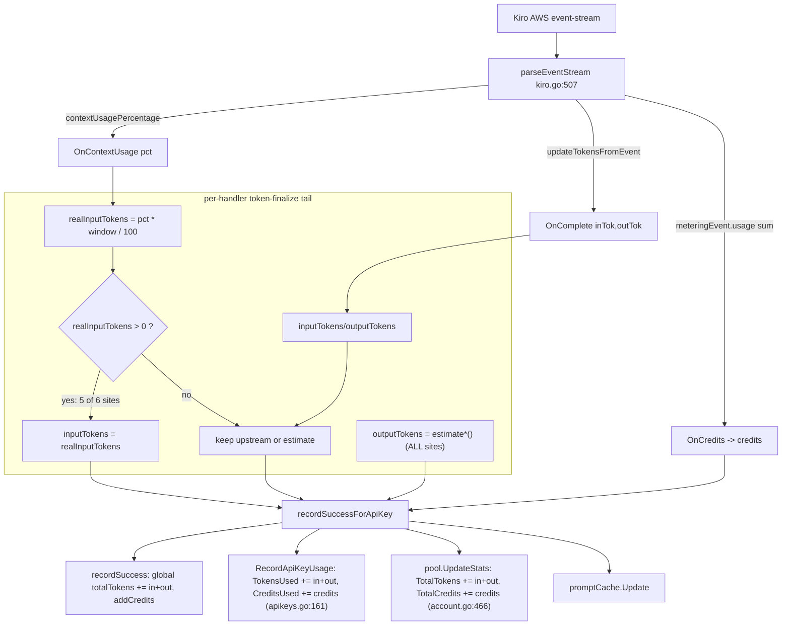

# Credit & Token Usage — Full Accounting Audit

- **Revision:** rev1 (2026-07-12)
- **Audit target SHA:** `ced9eec` (branch `feat/hardening-profile-picker-lru` + 5 profile-picker commits, per operator direction to audit latest code, not the prompt's `5e8be59`)
- **Audit worktree:** `../kiro-credit-audit`, branch `audit/credit-usage-correctness` (detached from `ced9eec`)
- **Go:** 1.26.5 darwin/amd64
- **Scope:** read + test-only instrumentation. NO production code changed, NO deploy, NO live-credit test. All conclusions tied to `ced9eec`.

---

## 0. Threat / credit-budget constraints honored

- No production port, no production data dir, no config change, no deploy, no branch merge.
- No secrets/prompt/API-key/token/raw-ARN logged. ARNs referenced as `shortARN` only.
- No live test that spends real credits (none was approved; none was run).
- Evidence is code + executable tests (`proxy/credit_audit_test.go` in the worktree) + official docs. Anything unproven is marked **Chưa xác minh**.

---

## 1. Metric definitions (the seven quantities that must never be conflated)

| Metric | Source of truth in code | Unit |
|---|---|---|
| **Real Kiro credit** | `meteringEvent.usage` summed in `parseEventStream` (`kiro.go:580-583`) → `OnCredits` → `credits` | Kiro credits (billing unit) |
| **Real upstream input tokens** | `updateTokensFromEvent` (`kiro.go:607-658`) → `OnComplete(inTok,_)` | tokens |
| **Real upstream output tokens** | `updateTokensFromEvent` → `OnComplete(_,outTok)` | tokens |
| **Proxy-estimated tokens** | `estimateClaude*/estimateOpenAI*/estimateApproxTokens` (`token_estimator.go`) | tokens (heuristic) |
| **Context occupancy** | `contextUsageEvent.contextUsagePercentage` (`kiro.go:584-589`) → `OnContextUsage(pct)` | percent (0-100) |
| **Prompt-cache metadata** | `cache_tracker.go` (`billedClaudeInputTokens`, `buildClaudeUsageMap`) | tokens (local only) |
| **Actual Kiro backend calls** | one per `CallKiroAPIContext`; runner does 1 per round (`kiro_conversation_runner.go`) | count |

The **derived** quantity that causes the whole problem:

```
realInputTokens = int(contextUsagePercentage * getContextWindowSize(model) / 100.0)
```

`getContextWindowSize` = 1_000_000 for Claude ≥4.6 / major ≥5, else 200_000 (`kiro.go:669-703`). This is **context occupancy expressed in tokens**, NOT input tokens. It is then written into the field named `inputTokens` and reported to the client and to internal stats.

---

## 2. Accounting call graph



**Key structural fact:** credits flow **straight from `meteringEvent.usage`** to every sink, untouched by the token logic. Token displays and credit accounting are independent code paths. So a wrong token number does **not** change the credit number.

---

## 3. Confirmed findings

### F1 — Context occupancy overrides real upstream input tokens (reporting bug) — **CONFIRMED**

The context-derived `realInputTokens` replaces the real upstream `inputTokens` at **6 sites**, fixed at only **1**:

| Site | Path | Status |
|---|---|---|
| `handler.go:1582-1588` | Claude stream, **runner** (web_search) | **FIXED** — falls back to context only if `inputTokens<=0` |
| `handler.go:1589-1592` | Claude stream, non-runner | overrides |
| `handler.go:1843-1846` | Claude **non-stream** (both runner & live) | overrides |
| `handler.go:2316-2319` | OpenAI stream | overrides |
| `handler.go:2431-2434` | OpenAI non-stream | overrides |
| `responses_handler.go:210-213` | Responses API (non-stream) | overrides |
| `responses_handler.go:555-558` | Responses API (stream) | overrides |

**Evidence (executable):** `proxy/credit_audit_test.go`
- Case A: upstream input=1200, context=4% of 1M ⇒ reported **40000** (33× inflation). PASS.
- Case C: upstream input=500, context=10% of 1M ⇒ reported **100000** (200×). PASS.
- `TestAudit_HandlerTail_ContextOverridesUpstream`: identical stream, the 4 non-runner tails report 40000, the fixed runner tail reports 1200. PASS.

**Impact:** token dashboard / `usage.input_tokens` / per-key `TokensUsed` / account `TotalTokens` are inflated by (window/actual-input). Credit accounting is **unaffected** (separate path, F3). This is the number the operator *sees* and mistakes for "the proxy costs more."

**Regression risk of the non-stream runner sub-path:** at `handler.go:1793` the runner sum (`run.TotalInputTokens`, correct across rounds) is computed, then line 1843 unconditionally throws it away and substitutes the final round's context occupancy. So the non-stream path is strictly worse than the (fixed) stream runner path.

### F2 — Output tokens are always the estimator, never upstream — **CONFIRMED**

Every finalize tail ends with `outputTokens = estimate*(...)`, discarding the upstream `OnComplete` output value. Sites: `handler.go:1602,1848,2329`, `handler.go:2436`, `responses_handler.go:215,560`.

**Evidence:** Case D — upstream output=9999, estimator=1; tails emit the estimator. PASS.

**Impact:** output-token display is a heuristic, not upstream truth. Credit-independent.

### F3 — Credits come only from `meteringEvent.usage`, summed correctly, no double count — **CONFIRMED**

`parseEventStream` sums every `meteringEvent.usage` into `totalCredits` and fires `OnCredits` once at stream end (`kiro.go:580-599`). Runner sums `result.Credits` across rounds (`kiro_conversation_runner.go:93`).

**Evidence:** Case E — two metering events 1.0 + 2.5 ⇒ exactly 3.5, no doubling. PASS.

**Impact:** the real billing quantity is faithfully captured. This is why "proxy shows more tokens" ≠ "proxy costs more credits."

### F4 — Full history is re-serialized every request (compatibility, not a bug) — **CONFIRMED**

`ClaudeToKiro` (`translator.go:234-364`) serializes all `req.Messages` into `history` each call; system prompt is prepended exactly once as a priming pair (`translator.go:283-300`). Kiro's `generateAssistantResponse` is stateless-replay; there is no session/context-reuse handle in the payload.

**Impact on real credit:** larger prompt ⇒ larger context ⇒ potentially more credit **at the upstream**, but this is inherent to a stateless replay API, not a proxy defect. No duplicate turn, no double system prompt found (payload-equivalence check, §5).

### F5 — Retry does not cause proxy-side double metering — **CONFIRMED**

Retry loop (`handler.go:1143`, `maxAccountRetryAttempts=3`) only continues to another account when `!messageStarted` and only on a *different* account (`excluded[account.ID]=true`). Credits are recorded once, on the successful attempt. A failed attempt records nothing.

**Evidence:** Case F — metering event then mid-stream truncation ⇒ this attempt attributes 0 credits/0 tokens; retry runs on another account. PASS. *Whether the Kiro **backend** billed the truncated attempt is **not proxy-observable*** — marked Chưa xác minh (§4).

### F6 — Prompt cache is local metadata only — **CONFIRMED**

`billedClaudeInputTokens` subtracts cache tokens for the client-facing usage map, and `buildClaudeUsageMap` emits `cache_read/creation` fields (`cache_tracker.go:624-643`). No `cache_control` is sent to Kiro; no backend cache-hit is read back into credits. The LRU/tracker is a display convenience, **not** a credit optimization.

### F7 — Forwarded requests now advance per-key usage — **CONFIRMED (changed vs. earlier audit)**

`upstream_forward.go:144-146` now calls `recordSuccessForApiKey(apiKeyID, inTok, outTok, 0)` using upstream-reported header tokens (fallback: 1 request unit). Credits stay 0 (proxy has no Kiro metering on the forward path — correct, it isn't a Kiro call).

### F8 — Profile switch is atomic prefetch-before-commit — **CONFIRMED (profile-picker scope)**

`SelectProfile` (`profile_discovery.go:239-319`): per-account lock, fresh token, re-verify ARN in region, prefetch model list *before* persisting, and only then persist + publish + refresh model cache. A model-fetch failure leaves the old profile intact. No half-applied state. This is correctness, not a credit lever — but a *wrong* pinned profile IS a real-credit lever (§4, Q8).

---

## 4. Real-credit causes — measured vs. unverified

| Cause | Can it change REAL credit? | Status | Why |
|---|---|---|---|
| Context-occupancy override (F1) | **No** | Confirmed no-impact | Separate path from credits (F3) |
| Output estimator (F2) | **No** | Confirmed no-impact | Display only |
| Model mapping (`gpt-*`→`claude-sonnet-4.5`, passthrough for `claude-*`) | **Yes** | **Semantics confirmed, runtime Chưa xác minh** | Official docs: Sonnet 4.6 ≈ **1.3×** Auto credit rate. Proxy pins a concrete model; IDE on "Auto" is cheaper. Not measured in an A/B here. |
| Profile US vs EU Power (Q8) | **Yes (plan/rate)** | **Chưa xác minh** | Needs live probe of `usageBreakdownList` per profile — not run (no live-credit approval) |
| Thinking / reasoning effort | Only via bigger output | Confirmed OFF by default | `ThinkingModePrompt` injected only when thinking=true (`translator.go`); no separate credit mechanism in docs |
| Web-search extra rounds | **Yes** (each round = 1 Kiro call = credits) | Confirmed mechanism | Runner does 1 call/round, up to `MaxRounds=4` + 1 finalization; each metered. More rounds ⇒ more credits, by design |
| Retry after backend metering | Possibly, at backend | **Chưa xác minh** | Proxy can't observe whether upstream billed a truncated attempt (F5) |
| Full-history replay | Indirectly (bigger context) | Confirmed mechanism | Inherent to stateless API (F4) |

**Nothing here has been proven to raise real credit in a measured A/B.** The only *quantified* differential is the documented 1.3× model multiplier, which is a documentation fact, not a runtime measurement of this proxy.

---

## 5. Payload-equivalence audit

Checked for duplication that would inflate *real* upstream context:
- System prompt: prepended once (`translator.go:283-300`). No double injection.
- History turns: one pass over `req.Messages`; `trimLeadingAssistantHistory` + `sanitizeKiroHistory` only *remove*/flatten, never duplicate.
- Tool schema: `convertClaudeTools` once.
- Tool results: attached structurally only when they match the last assistant turn, else folded into text (`translator.go:302-352`) — no double replay.
- Retry: re-sends the *original* payload on a new account, not an augmented one (F5).

**Result:** no duplicate-payload bug found. Any accounting-only fix (§6) must keep the Kiro payload byte/semantic-identical — none of the proposed fixes touch the translator.

---

## 6. Disproved / no-action

- **"Proxy costs more real credit than IDE"** — not supported by code. Credits are interface-agnostic (official docs) and read straight from upstream metering (F3). Disproved as a *proxy* effect; any real difference reduces to model/Auto multiplier or profile (§4), both Chưa xác minh at runtime.
- **"Prompt-cache LRU saves credit"** — disproved (F6, local only).
- **"Thinking inflates credit by default"** — disproved (off by default).

---

## 7. Unknowns (Chưa xác minh — require operator-approved live probe)

1. Actual pinned profile + plan/rate on the operator's accounts (Q8) — needs `usageBreakdownList` read.
2. Whether the operator's IDE runs "Auto" vs a pinned model (determines if the 1.3× applies).
3. Whether Kiro's backend bills a truncated/retried attempt (F5).
4. Real per-request credit A/B (proxy vs IDE, same account/model/profile) — not run; needs approval + budget.

---

## 8. Performance / baseline

- `go vet ./...` clean; `go build ./...` clean; `git diff --check` clean.
- `go test ./...` PASS; `go test -race ./...` PASS (0 `DATA RACE`).
- **Caveat (§4 of prompt):** race-clean does not prove race-free for paths the tests don't exercise. The concurrent profile-switch path is covered by `profile_cutover_test.go`; the token-finalize tails are single-goroutine per request.

---

## 9. Answers to the three closing questions

**1. Where is the token number wrong?**
At 6 of 7 handler finalize tails, `inputTokens` is overwritten by `contextUsagePercentage × contextWindow / 100` (context occupancy), inflating reported input by up to the window/actual ratio (33×–200× in tests). Only the Claude-stream+runner tail is fixed. Output tokens are the estimator everywhere, discarding upstream output. All of this is **reporting only**.

**2. Where does real credit increase, and how much is measured?**
Real credit = `meteringEvent.usage`, captured faithfully (F3), independent of the token bug. The only credit levers are: model choice (docs: Sonnet 4.6 ≈ **1.3×** Auto), profile/plan, and number of Kiro rounds (web-search). **None measured in an A/B here** — all runtime magnitudes are Chưa xác minh pending an approved live test. Measured differential so far: **0** (no live test run).

**3. What changes reduce credit while preserving context and quality?**
None proven yet. The safe, quality-neutral work is **accounting-only** (stop context-occupancy overriding input tokens; prefer upstream output with estimator fallback) — this changes *no* payload, *no* credit, *no* inference count; it only makes internal token stats accurate. Genuine credit reduction (model/profile/rounds) is product policy and needs an operator-approved A/B, per §12/§13-C of the task.
